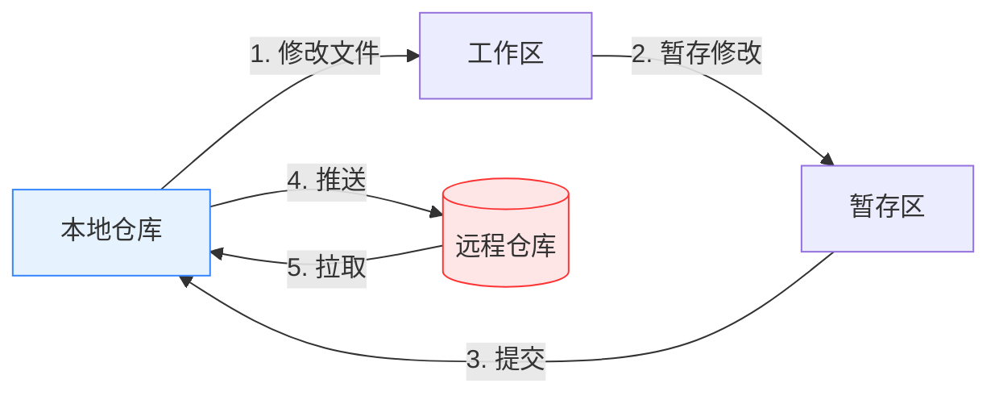

# Git Push & Pull 演示项目

本仓库演示使用 `push` 和 `pull` 命令进行协作的基本 Git 工作流程。

## 前提条件
- 本地安装 Git
- 拥有 GitHub 账号
- 了解 Git 提交的基本概念

## 教程指南

### 1. 克隆仓库
```bash
git clone https://github.com/weiyouc/pull-and-push-demo.git
```

### 2. 本地修改
1. 在本地仓库创建/编辑文件
2. 暂存修改：
```bash
git add .
```
3. 提交修改：
```bash
git commit -m "描述性提交信息"
```

### 3. 推送修改到远程
```bash
git push origin main
```
- 将本地提交推送到远程仓库
- 首次推送使用：
```bash
git push -u origin main
```

### 4. 拉取远程修改
```bash
git pull origin main
```
- 获取远程修改并合并到本地分支
- 如果出现冲突需要手动解决

## 工作流程图示



图示说明：
- 蓝色框: 本地操作
- 红色框: 远程仓库交互
- 箭头表示数据流向

## 常用选项
- 推送所有分支: `git push --all origin`
- 强制推送(慎用): `git push -f origin main`
- 变基拉取: `git pull --rebase origin main`

## 常见问题
- 认证问题: 使用 SSH 密钥或 GitHub CLI
- 本地版本过时: 推送前务必先拉取
- 合并冲突: 手动解决冲突后提交 