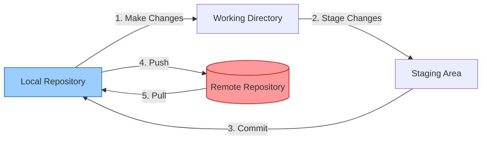

# Git Push & Pull Demo

This repository demonstrates basic Git collaboration workflows using `push` and `pull` operations.

## Prerequisites
- Git installed locally
- GitHub account
- Basic understanding of Git commits

## Tutorial

### 1. Clone the Repository
```bash
git clone https://github.com/weiyouc/pull-and-push-demo.git
```

### 2. Making Local Changes
1. Create/edit files in your local repository
2. Stage changes:
```bash
git add .
```
3. Commit changes:
```bash
git commit -m "Descriptive commit message"
```

### 3. Pushing Changes to Remote
```bash
git push origin main
```
- Pushes your local commits to the remote repository
- First time? Use:
```bash
git push -u origin main
```

### 4. Pulling Remote Changes
```bash
git pull origin main
```
- Fetches remote changes and merges them into your local branch
- Resolve any merge conflicts if they occur

## Workflow Diagram



Key:
- Blue box: Local Git operations
- Red box: Remote repository interactions
- Arrows show direction of data flow
